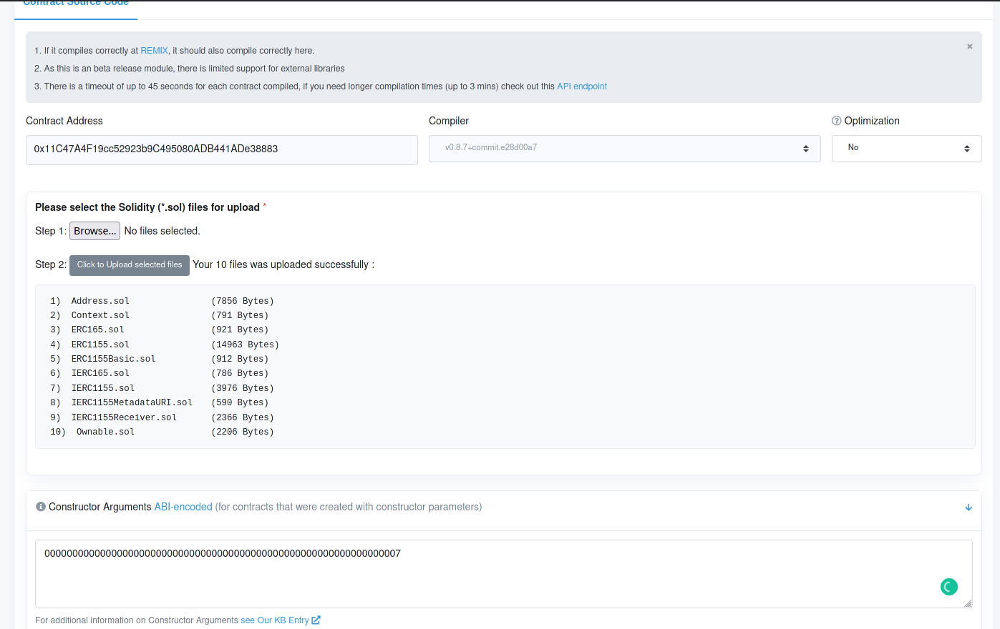

# Step By Step guide on how to create your very own ERC-1155 token

:::info

You can find the **codes** and **files** [`in the Github repo`](https://github.com/mlibre/blockchain/tree/master/Tutorials/Ethereum/ERC1155).

:::

In this guide, we will go through the process of how to create an `ERC-1155` token.  
`ERC-1155` is a multi-token standard. You can have many different tokens, fungible and non-fungible all together in one Smart Contract.  

# Requirements

* `Nodejs`: 14
  * `openzeppelin/contracts`: 4.3
  * `ethereum-smart-contract-deployer` : 1.1.6
    * `solc`: 0.8.9
    * `web3`: 1.6.0

You can install `Nodejs`, `Solidity` in your **Linux/Windows** with your package manager. in this case `Pacman`

```bash
sudo pacman -S nodejs geth
sudo npm install -g solc
solcjs --version
```

Clone the repo and install dependencies

```bash
git clone https://github.com/mlibre/blockchain
cd Ethereum/ERC1155/
npm i
```

# Files

* `ERC1155Basic.sol`: The contract source code
* `main.js`: A contract deployer written in **Nodejs**
* `bin`: Compile's output
* `MLB.json`: The tokens metadata. I have uploaded [here](https://siasky.net/AAC4OM8JRWH3DAx3bQ7qjAcVcpYD52WXzICO11KfvD4i3w)

# Getting start

As you may have already noticed, we are using the **openzeppelin** contracts V4.  
So the contract code, `ERC1155Basic.sol` is basically is few lines of codes!

```javascript
// SPDX-License-Identifier: MIT
pragma solidity ^0.8.7;

import "./node_modules/@openzeppelin/contracts/token/ERC1155/ERC1155.sol";
import "./node_modules/@openzeppelin/contracts/access/Ownable.sol";

contract MLBs is ERC1155, Ownable {
    uint256 public constant MLBFun = 0;
    uint256 public constant MLBNFun = 1;
    
    constructor(uint256 MLBFunIS)
    ERC1155("https://siasky.net/AAC4OM8JRWH3DAx3bQ7qjAcVcpYD52WXzICO11KfvD4i3w") {
        _mint(msg.sender, MLBFun, MLBFunIS * (10 **18), "");
        _mint(msg.sender, MLBNFun, 1, "");
    }

    function setURI(string memory newuri) public onlyOwner {
        _setURI(newuri);
    }

    function mint(address account, uint256 id, uint256 amount, bytes memory data)
        public
        onlyOwner
    {
        _mint(account, id, amount, data);
    }

    function mintBatch(address to, uint256[] memory ids, uint256[] memory amounts, bytes memory data)
        public
        onlyOwner
    {
        _mintBatch(to, ids, amounts, data);
    }
}
```

Here we have `MLBFun` that is a normal fungible token with id `0`.  
And `MLBNFun`, that is a normal non-fungible token with id `1`.

# Compile via Solc

> You don't have to compile the contract with `solc` as `Contract Deployer.js` will compile it itself. but it is good to see if there are any errors.  

```bash
solc ERC1155Basic.sol  -o ./bin/ --combined-json=abi,bin,metadata --pretty-json --optimize --metadata --gas --abi --bin --overwrite --color
```

## Options

* `--metadata`: creates metadata
* `--abi`: creates abi
* `--bin`: creates bin
* `--combined-json=abi,bin,metadata`: creates a json containing all above

# Deploying on Goerli

If everything went well. it is time to deploy our contract on the Blockchain!

## Importing an account into Geth

If you have not added your account in the local `Geth` before

```bash
# rm -r /home/mlibre/.ethereum/goerli/geth/
# rm -r /home/mlibre/.ethereum/geth
geth account import ~/Data/myself/cryptocurrency-info-recovery/metamask/mforgood/D8_private_key
# Set a password
```

## Unlocking an account in **Geth**

```bash
geth --goerli --http --syncmode=light --http.api="eth,net,web3,personal,txpool" --allow-insecure-unlock  --http.corsdomain "*"
geth attach http://127.0.0.1:8545
web3.personal.importRawKey("AccountPrivateKey", "ThePasswordYouJustSet")
# copy the address
personal.unlockAccount("TheAddress")
# Type the password
```

## Run Geth

If you have not run **Geth** already:

```bash
geth --goerli --http --syncmode=light --http.api="eth,net,web3,personal,txpool" --allow-insecure-unlock  --http.corsdomain "*"
```

## Running Deployer

Now It is time to deploy the contract on the blockchain.  
Open the `main.js` file and set the Deployer's arguments.

```bash
node main.js 
```

Congrats! it is done :)
the output should be something like this:

```java
Network Name:  goerli
Network Peers:  17

Solidity Version: 0.8.9
Compiling contract ERC1155Basic.sol -> MLBs

ETH balance:  5.824729999401939589
Gas:  3103808
Gas Price in ETH:  0.000000004
Total Cost in ETH:  0.012415232
ETH balance after deploying:  5.812314767401939

Deploying Contract ...
Arguments:  [ 7 ]

Transaction hash: 0x3964c8a6c1138567f342e7c091c975fd3460a87bd7eeb7b5b89d487b2d129d4a
Confirmation Number: 0
Owner: 0xD8f24D419153E5D03d614C5155f900f4B5C8A65C
Contract Address: 0xEDB1a4059b2E46280d2e1F646977b1715EC923c5
Etherscan.io: https://goerli.etherscan.io/address/0xEDB1a4059b2E46280d2e1F646977b1715EC923c5
```

If you click on the last link you will find the token.

# Verifying the contract

So first copy all the files contract uses, and then change the `imports' paths`.  
I have done it for this example. you can find all the modified files in **combined** folder.  
If **etherscan** was unable to detect the constructor parameters. you can use [hashex](https://abi.hashex.org/). copy the `TOKENNAME_abi.json` file that the deployer has made. and paste it in **hashex**. We passed the value '7' to the contract constructor.  

Open [goerli.etherscan.io/verifyContract](https://goerli.etherscan.io/verifyContract)

## Settings

* Contract Address: 0x11C47A4F19cc52923b9C495080ADB441ADe38883 (YOUR CONTRACT ADDRESS)
* Compiler Type: Multi part file
* Compiler Version: 0.8.9
* License MIT
* Optimization: No

## Images

* Settings

   

* Files upload. Files are necessary always like this. These photos just show the whole idea.

     

* Verified

   

## Interacting via Geth

```bash
geth attach http://127.0.0.1:8545
personal.unlockAccount("0xd8f24d419153e5d03d614c5155f900f4b5c8a65c")

var abi = [{"inputs":[{"internalType":"uint256","nam"
var MyContract = web3.eth.contract(abi);
# Copy Contract Address
var MyContractInstance = MyContract.at('0x11C47A4F19cc52923b9C495080ADB441ADe38883');
MyContractInstance.balanceOf("0xd8f24d419153e5d03d614c5155f900f4b5c8a65c" , {from: eth.accounts[0]});
MyContractInstance.transfer('10', "0x9998B1Eea4326FF00D77Efd9779Aac84d1bBA259" , {from: eth.accounts[0]});
```

## Interacting via web3js

If you like to call contract functions like `mint`, I have also implemented some in `main.js` like `getBalance` and `mint` **functions**.
