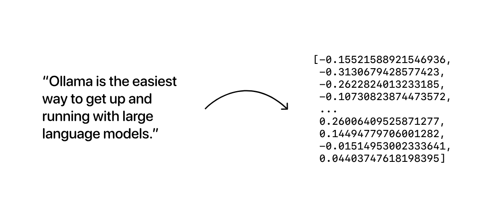

# Ollama

Ollama is an open-source AI model server. It can get and run large language models (LLMs) locally on your machine.

## Rocm

First make sure you have rocm or NVIDIA CUDA installed.

### Arch

```bash
sudo pacman -S base-devel cmake gcc python3
# pyenv is a tool to manage multiple versions of Python
curl https://pyenv.run | bash
echo 'export PYENV_ROOT="$HOME/.pyenv"' >> ~/.zshrc
echo '[[ -d $PYENV_ROOT/bin ]] && export PATH="$PYENV_ROOT/bin:$PATH"' >> ~/.zshrc
echo 'eval "$(pyenv init -)"' >> ~/.zshrc
source  ~/.zshrc
pyenv install 3.12
pyenv versions
pyenv global 3.12
# or use system to get back to system python
# pyenv global system


pip install --upgrade pip --break-system-packages
# If you have permission issues
# sudo rm /usr/lib/python3.12/EXTERNALLY-MANAGED
# sudo chmod a+rwx /usr/lib/python3.12/ -R

# https://wiki.archlinux.org/title/GPGPU
# Remove old packages
sudo pacman -Rns hsakmt-roct comgr hsa-rocr rocm-opencl-sdk rocm-opencl-runtime hip-runtime-amd miopen-hip rocm-clang-ocl roctracer rocminfo rocprim rocrand rocsolver rocsparse rocthrust rocm-smi-lib rocm-language-runtime rocm-hip-sdk rocm-hip-runtime rocalution rocm-hip-libraries rocfft rocblas rccl hipsparse hipcub hipsolver hiprand hipfft hipblas composable-kernel rocm-ml-libraries rocm-opencl-sdk rocm-ml-sdk

# Install rocm
sudo pamac install rocm-core hsa-rocr rocm-opencl-runtime comgr roctracer hsakmt-roct rocm-language-runtime rocminfo rocm-cmake hip rocm-smi-lib rocm-clang-ocl rocm-hip-runtime rocm-hip-sdk rocm-opencl-sdk rocm-device-libs --no-confirm
sudo usermod -a -G render,video $LOGNAME
sudo reboot
rocminfo
```

### Ubuntu

```bash
# https://rocm.docs.amd.com/projects/install-on-linux/en/latest/install/quick-start.html
# https://rocm.docs.amd.com/projects/install-on-linux/en/latest/install/native-install/ubuntu.html
# https://rocm.docs.amd.com/projects/install-on-linux/en/latest/install/amdgpu-install.html
# https://rocm.docs.amd.com/projects/install-on-linux/en/latest/install/post-install.html
sudo apt update
sudo apt install "linux-headers-$(uname -r)" "linux-modules-extra-$(uname -r)"
sudo usermod -a -G render,video $LOGNAME # Add the current user to the render and video groups
wget https://repo.radeon.com/amdgpu-install/6.2/ubuntu/noble/amdgpu-install_6.2.60200-1_all.deb
sudo apt install ./amdgpu-install_6.2.60200-1_all.deb
sudo apt update
sudo apt install amdgpu-dkms rocm
```

### Old GPUs

```bash
# If you are using RDNA or RDNA 2 architecture like AMD Radeon RX 6500 XT, you may need to follow this step:
sudo nano ~/.profile
# Add the following lines:
export HSA_OVERRIDE_GFX_VERSION=10.3.0
export ROC_ENABLE_PRE_VEGA=1

sudo systemctl edit --full ollama.service
Environment="HSA_OVERRIDE_GFX_VERSION=10.3.0"
Environment="ROC_ENABLE_PRE_VEGA=1"
```

### Test

```bash
pip install -U transformers datasets evaluate accelerate --user
sudo pip install -U transformers datasets evaluate accelerate


# https://www.tensorflow.org/install/pip
# https://rocm.docs.amd.com/projects/install-on-linux/en/latest/install/3rd-party/tensorflow-install.html#install-tensorflow-versions
pip install --user tensorflow-rocm=="2.16.1" -f "https://repo.radeon.com/rocm/manylinux/rocm-rel-6.2/" --upgrade
# cp312 means you need to have python 3.12


# https://pytorch.org/
pip3 install torch torchvision torchaudio --index-url https://download.pytorch.org/whl/rocm6.2.4 --break-system-packages
pip3 install -U torch torchvision torchaudio --index-url https://download.pytorch.org/whl/rocm6.1 --user
# sudo pip3 install -U torch torchvision torchaudio --index-url https://download.pytorch.org/whl/rocm6.1
pip3 install -U xformers --user
# sudo pip3 install -U xformers
```

```python
import tensorflow as tf
import torch

print(tf.config.list_physical_devices())
print(tf.__version__)

print(torch.cuda.is_available())
print(torch.version.hip)
```

## Install

### Native

```bash
curl -fsSL https://ollama.com/install.sh | sh

# Run a model
ollama run llama3.1:8b

# List models
ollama list

# Loaded Models
ollama ps

# Model Info
ollama show llama3.1:8b
#   Model
#         arch                    llama
#         parameters              8.0B
#         quantization            Q4_0
#         context length          131072
#         embedding length        4096

#   Parameters
#         stop    "<|start_header_id|>"
#         stop    "<|end_header_id|>"
#         stop    "<|eot_id|>"

# Logs
journalctl -u ollama.service --no-pager --follow 

```

### Docker

ollama supports docker images. You can either use official images or build your own.

You need to have [NVIDIA Container Toolkit](https://docs.nvidia.com/datacenter/cloud-native/container-toolkit/latest/install-guide.html#installation) installed for NVIDIA GPUs.  

And `rocm` for AMD GPUs.

```bash
# NVIDIA
docker run -d --gpus=all -v ollama:/root/.ollama -p 11434:11434 --name ollama ollama/ollama
# AMD
docker run -d --device /dev/kfd --device /dev/dri -v ollama:/root/.ollama -p 11434:11434 --name ollama ollama/ollama:rocm
# Run a model
docker exec -it ollama ollama run llama2
```

You can also build your own GPU supported image:

```bash
./scripts/build_linux.sh
```

## Files

Ollama files in Linux are located here:

```bash
/home/mlibre/.ollama
/usr/local/bin/ollama
/usr/share/ollama
/etc/systemd/system/ollama.service
/etc/systemd/system/default.target.wants/ollama.service
```

## Debug

```bash
sudo systemctl edit --full ollama.service

[Unit]
Description=Ollama Service
After=network-online.target

[Service]
ExecStart=/usr/local/bin/ollama serve
User=ollama
Group=ollama
Restart=always
RestartSec=3
Environment="PATH=/home/mlibre/.local/bin:/usr/local/sbin:/usr/local/bin:/usr/bin:/usr/bin/site_perl:/usr/bin/vendor_perl:/usr/bin/core_perl"
Environment="OLLAMA_HOST=0.0.0.0"
Environment="OLLAMA_DEBUG=1"
Environment="HSA_OVERRIDE_GFX_VERSION=10.3.0"
Environment="ROC_ENABLE_PRE_VEGA=1"
[Install]
WantedBy=default.target
# you may also add Environment="HSA_OVERRIDE_GFX_VERSION=10.3.0" to support older AMD GPUs


sudo systemctl restart ollama.service
journalctl -u ollama --no-pager -f
```

## Usage

```bash

# Generate text
curl http://localhost:11434/api/generate -d '{
  "model": "llama3.1:8b",
  "prompt":"Why is the sky blue?"
}'

# Chat
curl http://localhost:11434/api/chat -d '{
  "model": "llama3.1:8b",
  "messages": [
    { "role": "user", "content": "why is the sky blue?" }
  ],
  "stream": false,
  "system": "You are Sarah. you only uses emojies to answer and nothings else. you only uses one emoji each time"
}' | jq

# Chat with history
curl -s http://localhost:11434/api/chat -d '{
  "model": "llama3.1:8b",
  "messages": [
    {
      "role": "user",
      "content": "You are Sarah. you only uses emojies to answer and nothings else. you only uses one emoji each time"
    },
    {
      "role": "assistant",
      "content": "👋💁"
    },
    {
      "role": "user",
      "content": "hey"
    }
  ],
  "stream": false,
  "system": "You are Sarah. you only uses emojies to answer and nothings else. you only uses one emoji each time"
}' | jq

# Embeddings
curl http://localhost:11434/api/embed -d '{
  "model": "llama3.1:8b",
  "prompt":"Why is the sky blue?"
}'

# OpenAI Compatibile
curl -s http://localhost:11434/v1/chat/completions \
  -H "Content-Type: application/json" \
  -d '{
    "model": "llama3.1:8b",
    "messages": [
      {
        "role": "user",
        "content": "You are Sarah. you only uses emojies to answer and nothings else. you only uses one emoji each time"
      },
      {
        "role": "assistant",
        "content": "👋💁"
      },
      {
        "role": "user",
        "content": "hey"
      }
    ],
    "stream": false,
    "system": "You are Sarah. you only uses emojies to answer and nothings else. you only uses one emoji each time"
  }' | jq

curl -s http://localhost:11434/v1/chat/completions \
  -H "Content-Type: application/json" \
  -d '{
    "model": "llama3.1:8b",
    "messages": [
      {
        "role": "system",
        "content": "You are Sarah. you only uses emojies to answer and nothings else. you only uses one emoji each time"
      },
      {
        "role": "user",
        "content": "hey"
      }
    ],
    "stream": false
  }' | jq
```

## Costomizing Model

```bash
nano Modelfile

FROM llama3.1:8b

SYSTEM """
You are Mario from Super Mario Bros. Answer as Mario, only. And Always start your answer with HAYAYAYA
"""
```

```bash
ollama create mario -f ./Modelfile
ollama run mario
```

## Embedding models

Ollama supports embedding models, making it possible to build retrieval augmented generation (RAG) applications that combine text prompts with existing documents or other data.

Embedding models are models that are trained specifically to generate vector embeddings.



The resulting vector embedding arrays can then be stored in a database, which will compare them as a way to search for data that is similar in meaning.

You can store as many text as you want in these vector databases, such as a [vector database](https://www.trychroma.com/). for example you can embed some books, and then ask chroma to find the most similar text to a given input. you then send chroma output to a LLM, and the LLM can use the context of the text to generate a response.

> more information is here: <https://ollama.com/blog/embedding-models>

### Installation

```bash
ollama pull mxbai-embed-large

curl http://localhost:11434/api/embeddings -d '{
  "model": "mxbai-embed-large",
  "prompt": "Llamas are members of the camelid family"
}'

curl http://localhost:11434/api/embeddings -d '{
  "model": "llama3.1:8b",
  "prompt": "Llamas are members of the camelid family"
}'
```

## Configuration

```bash
sudo systemctl edit --full ollama.service
Environment="OLLAMA_HOST=0.0.0.0"
```

## Memory and Quantization Options

When working with models like the Codestral 22B, you have several quantization options that affect both memory usage and accuracy:

* 32-bit floating-point: Uses 88 GB of memory (22 x 4 = 88G) and is the most accurate
* 16-bit floating-point: Uses 44 GB of memory (22 x 2 = 44G)
* 8-bit floating-point: Uses 22 GB of memory (22 x 1 = 22G)
* 4-bit floating-point: Uses 11 GB of memory (22 x 1/2 = 11G) and is less accurate

These options allow you to balance between model accuracy and the amount of memory used, depending on your system's resources and the specific needs of your application.

### GPU Compatibility

To effectively run models like Codestral 22B, you need a GPU with sufficient memory to handle the model's requirements:

* **RTX 6000**: With 48 GB of memory, this GPU can handle 16-bit floating-point quantization (44G) and lower, providing a good balance of accuracy and performance.
* **NVIDIA RTX 4090**: With 24 GB of memory, this GPU is suited for 8-bit floating-point quantization (22G) and below.
* **GeForce GTX 1080 Ti**: With 11 GB of memory, this GPU is limited to 4-bit floating-point quantization (11G), which may result in reduced accuracy but still allows you to run the model on less capable hardware.

You can find full list of ollama supported gpus here: <https://github.com/ollama/ollama/blob/main/docs/gpu.md>

## Uninstall

```bash
sudo systemctl stop ollama
sudo systemctl disable ollama
sudo rm /etc/systemd/system/ollama.service
sudo rm $(which ollama)
sudo rm -r /usr/share/ollama
sudo rm -r ~/.ollama
sudo userdel ollama
sudo groupdel ollama
```

## Ollama.js

```bash
npm i ollama
sudo npm i ollama -g
```

* Simple example

```js
const ollama = require('ollama').default

void async function main() {
  const response = await ollama.chat({
    model: 'llama3.1:8b',
    messages: [
      {
        "role": "user",
        "content": "You are Sarah. you only uses emojies to answer and nothings else. you only uses one emoji each time"
      },
      {
        "role": "assistant",
        "content": "👋💁"
      },
      {
        "role": "user",
        "content": "hey"
      }
    ],
  })
  console.log(response.message.content)
```

* Streaming example

```js
  const message = { role: 'user', content: 'Why is the sky blue?' }
  const response = await ollama.chat({ model: 'llama3.1:8b', messages: [message], stream: true })
  for await (const part of response) {
    process.stdout.write(part.message.content)
  }
}()
```

* Advanced example

```js
const { Ollama } = require( "ollama" )

// Simulates an API call to get flight times
// In a real application, this would fetch data from a live database or API
function get_flight_times ( departure, arrival )
{
 const flights = {
  "LAX-NYC": { departure: "02:00 PM", arrival: "10:30 PM", duration: "8h 30m" },
  "LHR-JFK": { departure: "10:00 AM", arrival: "01:00 PM", duration: "3h 00m" },
  "NYC-LAX": { departure: "08:00 AM", arrival: "11:30 AM", duration: "3h 30m" },
  "JFK-LHR": { departure: "09:00 PM", arrival: "09:00 AM", duration: "12h 00m" },
  "CDG-DXB": { departure: "11:00 AM", arrival: "08:00 PM", duration: "9h 00m" },
  "DXB-CDG": { departure: "03:00 AM", arrival: "07:30 AM", duration: "4h 30m" }
 };

 const key = `${departure}-${arrival}`.toUpperCase();
 return JSON.stringify( flights[key] || { error: "Flight not found" });
}

const get_flight_times_schema = {
 type: "function",
 function: {
  name: "get_flight_times",
  description: "Get the flight times between two cities",
  parameters: {
   type: "object",
   properties: {
    departure: {
     type: "string",
     description: "The departure city (airport code)",
    },
    arrival: {
     type: "string",
     description: "The arrival city (airport code)",
    },
   },
   required: ["departure", "arrival"],
  },
 }
}

const availableFunctions = {
 get_flight_times,
};

function handleToolCalls ( toolCalls, messages )
{
 for ( const tool of toolCalls )
 {
  const functionToCall = availableFunctions[tool.function.name];
  if ( functionToCall )
  {
   const functionResponse = functionToCall(
    tool.function.arguments.departure,
    tool.function.arguments.arrival
   );
   // Add function response to the conversation
   messages.push({
    role: "tool",
    content: functionResponse,
   });
  }
 }
}

void async function main ()
{
 const ollama = new Ollama({ host: "http://127.0.0.1:11434" })
 const model = "llama3.1:8b";

 let messages = [{ role: "user", content: "What is the flight time from New York (NYC) to Los Angeles (LAX)?" }];
 // First API call: Send the query and function description to the model
 const response = await ollama.chat({
  model,
  messages,
  tools: [get_flight_times_schema],
 })
 // Add the model's response to the conversation history
 messages.push( response.message );
 if ( response.message.tool_calls && response.message.tool_calls.length > 0 )
 {
  handleToolCalls( response.message.tool_calls, messages );
 }
 else
 {
  console.log( response.message.content );
  return
 }

 // Second API call: Get second response from the model
 const response2 = await ollama.chat({
  model,
  messages,
 });
 messages.push( response2.message );
 console.log( response2.message.content );

 messages.push({ role: "user", content: "What is the flight time from CDG to DXB?" });
 const response3 = await ollama.chat({
  model,
  messages,
  tools: [get_flight_times_schema]
 });
 messages.push( response3.message );
 if ( response3.message.tool_calls && response3.message.tool_calls.length > 0 )
 {
  handleToolCalls( response3.message.tool_calls, messages );
 }
 else
 {
  console.log( response.message.content );
  return
 }

 const response4 = await ollama.chat({
  model,
  messages,
  tools: [get_flight_times_schema]
 });
 console.log( response4.message.content );
}()
```

## Reference

* <https://ollama.com/>
