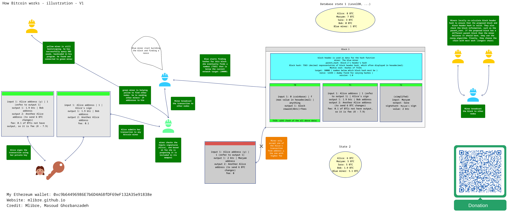

# Bitcoin

A `blockchain` is a list of records, called blocks, which are linked and secured using cryptography.  
Each block contains a cryptographic hash of the previous block, a timestamp, and a list of transactions.  
A blockchain is simply a public distributed ledger, and `bitcoin` is a `blockchain`.  

I have also implemented a simple Proof-of-Work (POW) blockchain like bitcoin, you can find it [here](https://github.com/mlibre/blockchain/tree/master/Tutorials/Bitcoin/pow-from-scratch)

## Table of content

* [Table of content](#table-of-content)
* [Visualization of how Bitcoin is Workings](#visualization-of-how-bitcoin-is-workings)
* [Architecture](#architecture)
  * [Network Discovery](#network-discovery)
* [Consensus](#consensus)
* [Incentives](#incentives)
* [Addresses And Wallets](#addresses-and-wallets)
* [Transaction](#transaction)
* [Longest chain](#longest-chain)
* [Chain Reorganisation](#chain-reorganisation)
* [Double Spending](#double-spending)
* [Where do bitcoins come from?](#where-do-bitcoins-come-from)
* [Bitcoin Storage](#bitcoin-storage)
* [Merkle Root](#merkle-root)
* [Simple POW Blockchain in nodejs](#simple-pow-blockchain-in-nodejs)
* [References](#references)
* [My Bitcoin Address](#my-bitcoin-address)

## Visualization of how Bitcoin is Workings



## Architecture

The `Bitcoin` network is a `decentralized peer-to-peer` network, meaning that it operates without a central authority or server. Nodes, connect to each other directly, allowing data to be shared and stored.  

Bitcoin combines its **network**, **cryptocurrency**, and **blockchain** to record transactions transparently, prevent double spending, and ensure consensus via a process called **proof-of-work**

### Network Discovery

**Network Discovery** or **Peer Discovery** in Bitcoin refers to the process by which nodes in the Bitcoin network find and connect with each other. When a new node joins the network, it starts to discover other nodes to connect with in order to participate in the network. This is typically done through a process called `bootstrapping`.

1. When started for the first time, programs don’t know the **IP addresses** of any active full **nodes**. In order to **discover** some IP addresses, they **query** one or more `DNS seeds` hardcoded into `Bitcoin Core` and `BitcoinJ`. The response to the lookup should include one or more DNS A records with the IP addresses of full nodes that may accept new incoming connections. For example, using the `dig` command:

   ```bash
   dig seed.bitcoin.sipa.be

   ;; ANSWER SECTION:
   seed.bitcoin.sipa.be.   3600    IN      A       185.14.30.25
   seed.bitcoin.sipa.be.   3600    IN      A       18.213.155.196
   seed.bitcoin.sipa.be.   3600    IN      A       176.9.150.253
   seed.bitcoin.sipa.be.   3600    IN      A       79.137.224.63
   seed.bitcoin.sipa.be.   3600    IN      A       76.138.214.41
   ```

   > DNS seed: A DNS server which returns IP addresses of full nodes on the Bitcoin network to assist in peer discovery.

2. Once a program has connected to the network, its `peers` can begin to send it `addr` (address) messages with the `IP addresses` and `port numbers of other peers` on the network, providing a fully decentralized method of peer discovery. `Bitcoin Core` keeps a record of known peers in a **persistent on-disk database** which usually allows it to connect directly to those peers on subsequent startups without having to use DNS seeds

## Consensus

Bitcoin achieves consensus through a process called `proof-of-work mining`. Miners spend computational resources to find a solution to a cryptographic puzzle, and whichever miner finds the solution is able to create the next block.

## Incentives

The Bitcoin protocol offers two main incentives for mining:

- Block rewards: New bitcoins are minted with each block, and the miner who finds the block receives the block reward
- Transaction fees: Each transaction on the Bitcoin network includes a transaction fee, paid to the miner who includes that transaction in a block

## Addresses And Wallets

There is no such thing as a `Wallet` in the Bitcoin network. It is `abstract`.  

- Address

An address is a hash of a bitcoin public-key wallet.  
You can use an address as many as you want to send and receive Bitcoin.  

- Wallet

A wallet is a software program that stores `key-pairs`, created `addresses`, and other information needed to access and manage your `Bitcoins`.  

- Key-pairs

Key-pairs are a public key of an address to which some amount bitcoin was previously sent and the corresponding unique private key, which authorizes the bitcoin previously sent to the above public key (address) to be sent elsewhere.

## Transaction

A `Bitcoin` `transaction` is a transfer of Bitcoins from one user to another. It is a data structure that contains several fields, including inputs, outputs, and other metadata.  
When a `Bitcoin` transaction is created, it is `broadcast` to the Bitcoin network and propagated to all `nodes` on the network. Each node verifies the transaction by checking that the digital signatures in the inputs field are valid. Once the transaction is verified by the nodes, it is added to the `mempool`, which is a pool of `unconfirmed transactions` `waiting` to be `included` in the `next block`.

A transaction components are:

- Inputs - Information about the Bitcoin previously sent to Mark's address. For example, imagine Mark previously received 0.6 BTC from Alice and 0.6 BTC from Bob. Now, in order to send 1 BTC to Jessica, there might be two inputs: one input of 0.6 BTC previously from Alice and one input of 0.6 BTC previously from Bob.
- Amount - The amount being sent, In this case Mark wants to send 1 BTC.
- Outputs - The destination addresses of the Bitcoins. The first is 1.2 BTC (0.6 BTC + 0.6 BTC) to Jessica’s public address. The second is 0.2 BTC returned as 'change' to Mark.

## Longest chain

The **longest chain** refers to the chain of blocks that the majority of nodes on the network agree to and adopt as the authoritative blockchain. The longest chain is not determined by the number of blocks but by the amount of computational power or energy used to mine the blocks in the chain.

## Chain Reorganisation

A **chain reorganisation** takes place when your node receives blocks that are part of a new **longest chain**. Your node will **deactivate** blocks in its **old longest chain** in favour of the blocks that build the new longest chain.  

A chain reorganisation most commonly takes place after **two blocks have been mined** at the same time.

The `next block` to be mined will build upon one of these two blocks, creating a new longest chain that all nodes on the network will be happy to adopt

## Double Spending

Double spending is when someone (A) tries spending the same bitcoin twice. Bitcoin network prevents this.  
When A broadcast the two transactions, they will go in unconfirmed transactions' pools. From there when a miner (X) validates the first transaction, the bitcoin will be sent to the new owner. so X will invalidate the second transaction because A is not the owner of the bitcoin anymore. But if the two transactions gets validated and mined by two different miners and gets added to the next block. it means there are two different blockchains now. (one with the first transaction and one with the second transaction). Now Chain Reorganisation comes into play. miners will always accept the longest chain.  

## Where do bitcoins come from?

As an incentive to use processing power to try and add new blocks of transactions on to the blockchain, each new block makes available a fixed amount of bitcoins that did not previously exist. Therefore, if you are able to successfully mine a block, you are able to “send” yourself these new bitcoins as a reward for your effort.

## Bitcoin Storage

`Bitcoin` does not enforce a specific structure for storing the transaction journal, but most implementations utilize a database like `LevelDB` for efficient storage of transactions and related metadata

## Merkle Root

The `Merkle root` is an important part of blocks in the Bitcoin blockchain. The `Bitcoin` blockchain is **not a single Merkle tree**, but rather a chain of blocks. Each block contains a `Merkle root`, This `Merkle root` is built using a **Merkle tree** structure and is used to verify the integrity of the transactions in the block. To get the **leaves** for our tree, we use the transaction hash (the `TXID`) of every transaction included in the block.  
You get a `TXID` by hashing transaction data through `SHA256` twice.

Each new block contains a hash of the **previous block's header**. This connects the blocks in a chain, because if anything changes in a previous block, the hash will change too.

Specifically, each block header includes a `Merkle root` hash representing all the transactions in that block. If even a single transaction in the block were **modified**, it would cause the `TXID` of that trasnaction to change. and so the **Merkle root to change**. This would make the block's overall **header hash** change too.

So the `Merkle root` allows any changes to previous transactions to be detected. If a transaction were deleted from a previous block, the Merkle root in the header of all following blocks would change. This would break the chain of hashes connecting the blocks.

You might wonder why we don't simply **hash all transactions** together to create a `transactions hash` field in the block header, instead of hashing them in **pairs** to create a `Merkle root`.  
While hashing all transactions together would ensure data **integrity**, it would **not be efficient** for **verification**. For instance, if a node wants to verify that a transaction is contained in a block (which has, let's say, 100 transactions), it would need to download and hash all 99 other transactions hashes. If the resulting hash matches the expected hash, then the transaction is confirmed to be in the block.

However, with a Merkle tree, the process is much more efficient. The node only needs to obtain a few `Merkle proofs`. With a simple mathematical algorithm, it can confirm that the transaction is indeed included in the block. This is because Merkle trees allow for the proof of data belonging to a set without needing to store the entire set.

For instance, to prove that a specific transaction 'a' is part of a Merkle tree, everyone in the network will be aware of the hash function used by all Merkle trees. The hash of 'a' and its corresponding hash are hashed together, moving up the tree until the **root hash**, which is **publicly known**, is obtained. By comparing the obtained **Merkle root** and the **Merkle root** already available within the block header, the presence of transaction 'a' in this block can be verified. From this example, it is clear that in order to verify the presence of 'a', 'a' does not have to be revealed, nor do the other transactions have to be revealed; only some of their hashes are sufficient. This makes **Merkle proof** an efficient and simple method of verifying inclusivity.

The **mathematical** process of verifying a Merkle proof involves hashing the value in question with the hashes provided in the proof, iteratively, until you arrive at a computed Merkle root. If this computed root matches the known Merkle root of the block, the proof is valid, and the transaction is confirmed to be part of the block

When you broadcast a transaction to the Bitcoin network, your wallet can download the new block headers and check if the transaction it created for you is included in the new block or not. This is made possible by the Merkle Tree structure.

## Simple POW Blockchain in nodejs

[Here you can find a simple complete POW blockchain written in nodejs](https://github.com/mlibre/blockchain/tree/master/Tutorials/Bitcoin/pow-from-scratch)

## References

- <https://www.bitcoin.com/get-started/>
- <https://academy.binance.com/en/articles/double-spending-explained>
- <https://www.youtube.com/watch?v=phLSjZdDc5A>
- <https://learnmeabitcoin.com/technical/longest-chain>
- <https://www.geeksforgeeks.org/blockchain-merkle-trees/>
- <https://www.geeksforgeeks.org/blockchain-merkle-trees/>
- <https://academy.binance.com/en/articles/merkle-trees-and-merkle-roots-explained>

## My Bitcoin Address

> bc1qgwu903shgs4fse3s8u2vsufrsaxhnz26skqmzu
