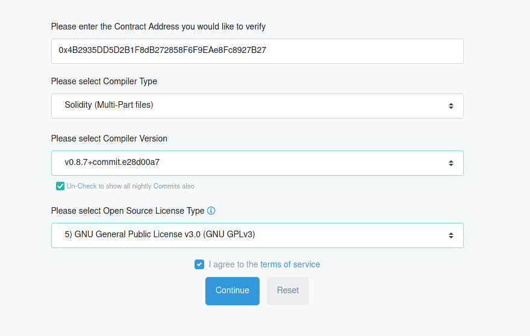

# Step By Step guide on how to create your very own ERC20 token

:::info

You can find the **codes** and **files** [`in the Github repo`](https://github.com/mlibre/blockchain/tree/master/Tutorials/Ethereum/ERC20).

:::

In this guide, we go through step by step guide on how to create an `ERC20` token. we will use:  

* `Nodejs`: 14
  * `openzeppelin/contracts`: 4.3
  * `ethereum-smart-contract-deployer` : 1.1.6
    * `solc`: 0.8.9
    * `web3`: 1.6.0

## Getting start

Install `Nodejs`, `Solidity` in your **Linux/Windows**. and clone the repo.

```bash
sudo pacman -S nodejs geth
sudo npm install -g solc
solcjs --version
```

Clone the repo and install dependencies

```bash
git clone https://github.com/mlibre/blockchain
cd Ethereum/ERC721/
npm i
npm i --dev-only
```

## Files

* `ERC20Basic.sol`: The contract
* `main.js`: A Nodejs contract deployer
* `bin`: Compiles' outputs

As you may have already noticed, we are using the **openzeppelin** contracts V4.  
So the contract code, `ERC20Basic.sol` is basically few lines of codes!

```javascript
// SPDX-License-Identifier: GPL-3.0
pragma solidity ^0.8.9;

import "./node_modules/@openzeppelin/contracts/token/ERC20/ERC20.sol";
import "./node_modules/@openzeppelin/contracts/access/Ownable.sol";

contract MlibreToken is ERC20, Ownable {
   constructor(uint256 initialSupply) ERC20("Mlibre", "MLB") {
      _mint(msg.sender, initialSupply * (10 ** uint256(decimals())));
   }
    function mint(address to, uint256 amount) public onlyOwner {
     _mint(to, amount);
   }
}
```

`initialSupply` is the amount of total token supply, we pass it on the creation time.  
`mint` **function** gives us the ability to mint tokens later.

## Compile via Solc

> You don't have to compile the contract with `solc` as `Contract Deployer.js` will compile it itself. but it is good to see if there are any errors.  

```bash
solc ERC20Basic.sol  -o ./bin/ --combined-json=abi,bin,metadata --pretty-json --optimize --metadata --gas --abi --bin --overwrite --color
```

### Options

* `--metadata`: creates metadata
* `--abi`: creates abi
* `--bin`: creates bin
* `--combined-json=abi,bin,metadata`: creates a json containing all above

## Deploying on Goerli

If everything went well. it is time to deploy our contract on the Blockchain!

```bash
geth --goerli --http --syncmode=light --http.api="eth,net,web3,personal,txpool" --allow-insecure-unlock  --http.corsdomain "*"
```

### Running Deployer

Now It is time to deploy the contract on the blockchain.  
Open the `main.js` file and set the Deployer's arguments.

```bash
node main.js 
```

Congrats! it is done :)
the output should be something like this:

```java
Network Name:  goerli
Network Peers:  17

Solidity Version: 0.8.9
Compiling contract ERC20Basic.sol

ETH balance:  5.801357301927762163
Gas:  1645359
Gas Price in ETH:  0.000000001500000007
Total Cost in ETH:  0.0024680385115175129
ETH balance after deploying:  5.798889263416244

Deploying Contract MlibreToken
Arguments:  [ 12300000000 ]

Transaction hash: 0xe61eb01b53e859059b40e86b7119594ca48df793fbda73c69f201e76a96ae23d
Block number:  5819409
Owner: 0xD8f24D419153E5D03d614C5155f900f4B5C8A65C
Contract Address: 0x2107130860b83dF501C518A2A6D4652dC3af0388
Etherscan.io: https://goerli.etherscan.io/address/0x2107130860b83dF501C518A2A6D4652dC3af0388
```

If you click on the last link you will find the token on Etherscan.io.

## Verifying the contract

Verifying contracts on etherscan are a bit hard right now :)  
So first copy all the files that contract uses in a folder, use a same the `solidity` version for all.  
Now fix the `imports' paths`, and compile it again.  
I have done it for our case and put the modified files in the `combined` folder.  
If **etherscan** was unable to detect the constructor parameters. you can use [hashex](https://abi.hashex.org/).  
Copy the `TOKENNAME_abi.json` file that the deployer has made. and paste it in [hashex](https://abi.hashex.org/). I pass the value '12300000000' to the contract constructor.  

Open [goerli.etherscan.io/verifyContract](https://goerli.etherscan.io/verifyContract)

### Settings

* Contract Address: 0xEf6b32e2375EC3C2bc342Bb8fEA6040A5E426C9b (YOUR CONTRACT ADDRESS)
* Compiler Type: Multi part files
* Compiler Version: 0.8.9
* License GPL-v3
* Optimization: No

### Images

* Settings

   

* Files upload. Files are necessary always like this. These photos just show the whole idea.

     

* Verified

   

### Interacting via Geth

```bash
geth attach http://127.0.0.1:8545
personal.unlockAccount("0xd8f24d419153e5d03d614c5155f900f4b5c8a65c")

var abi = [{"inputs":[{"internalType":"uint256","nam"
var MyContract = web3.eth.contract(abi);
# Copy Contract Address
var MyContractInstance = MyContract.at('0x4B2935DD5D2B1F8dB272858F6F9EAe8Fc8927B27');
MyContractInstance.balanceOf("0xd8f24d419153e5d03d614c5155f900f4b5c8a65c" , {from: eth.accounts[0]});
MyContractInstance.transfer('10', "0x9998B1Eea4326FF00D77Efd9779Aac84d1bBA259" , {from: eth.accounts[0]});
```

### Interacting via web3js

```javascript
async function mint(web3, contract, amount) {
 await web3.eth.personal.unlockAccount(options.sender , options.password, 150)
 let contractInstance = new web3.eth.Contract(contract.abi, options.token);
 const result = await contractInstance.methods.mint(options.sender , amount.toString()).send({from: options.sender})
 console.log(result);
}
```
